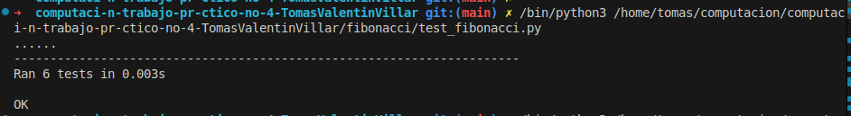

# Descripcion del problema
    Este programa implementa n-ésimo número en la secuencia de Fibonacci, 
    tanto de forma iterativa como recursiva. a secuencia de Fibonacci es una serie 
    numérica donde cada número es la suma de los dos anteriores, comenzando con 0 y 1.
# Instrucciones de uso
    ejecutar en terminal: python fibonacci/fibonacci.py

    El programa pedirá ingresar un número para n-ésimo número en la secuencia de Fibonacci.
    Si el numero es negativo se indicará que es una entrada invalida.
    Se puede finaliza el programa con Ctrl + C
# Ejemplos de uso

    Ingrese un numero para calcular Fibonacci: 12
    el resultdo es 144

    Ingrese un numero para calcular el factorial: -3
    Entrada inválida: el Fibonacci no acepta negativos

    Ingrese un numero para calcular el factorial: ^C
    Programa finalizado.
# Captura de pantalla de los test ejecutados
