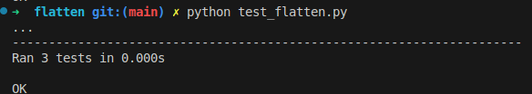

# Descripcion del problema
    Este proyecto implementa una función recursiva (aplanar_lista()) que transforma estructuras de
    datos anidadas (listas, tuplas y diccionarios) en una lista plana, preservando el orden de los elemento
# Instrucciones de uso
    ejecutar en terminal: python flatten/flatten.py

    El programa pedirá ingresar una lista para aplanarla
    Se puede finaliza el programa con Ctrl + C
# Ejemplos de uso

    Ingrese una lista anidada: [1,2,[3,4],5]
    Lista aplanada: [1, 2, 3, 4, 5]

    Ingrese una lista anidada: [1, (2, 3), {'a': 4, 'b': 5}, [6, [7, 8]]]
    Lista aplanada: [1, 2, 3, 'a', 4, 'b', 5, 6, 7, 8]

    Ingrese una lista anidada: (1,2,3,4)
    Lista aplanada: [1, 2, 3, 4]

    Ingrese una lista anidada: ^C
    Programa finalizado.
# Captura de pantalla de los test ejecutados
